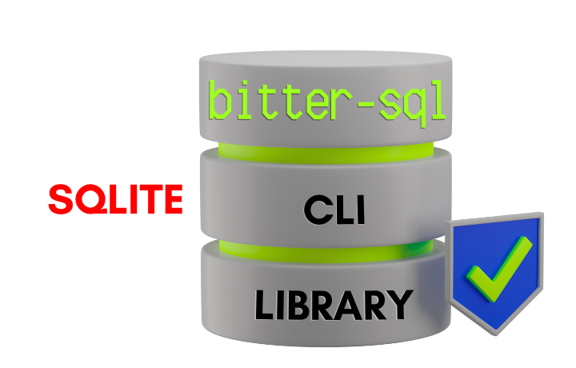

<div align="center">
  
  
  # bitter-sql
  
  **SQLite 3 Database Scaffolding with Encryption**
  
  [](https://www.npmjs.com/package/bitter-sql)
  [](https://opensource.org/licenses/MIT)
  [](https://github.com/kellydc/bitter-sql/actions)
  [](https://github.com/kellydc/bitter-sql)
  [](https://snyk.io/test/github/kellydc/bitter-sql)
</div>

---

## Overview

A lightweight, developer-friendly SQLite database scaffolding tool with built-in encryption support. bitter-sql simplifies creating and managing encrypted databases through an intuitive CLI or as a Node.js library.

**Key highlights:**

- 🔐 Multiple encryption ciphers (SQLCipher, ChaCha20, AES variants)
- ⚡ Fast operations powered by [better-sqlite3-multiple-ciphers](https://github.com/m4heshd/better-sqlite3-multiple-ciphers)
- 🎯 Secure by default with interactive mode
- 📦 Use as CLI tool or library
- 🛡️ Passwords never exposed in shell history

Perfect for development databases, secure data storage, and encrypted backups.

## Features

- **Database Encryption**: Support for multiple encryption ciphers (ChaCha20-Poly1305, SQLCipher, AES256CBC, AES128CBC, RC4)
- **Secure by Default**: Interactive mode enables encryption by default with recommended cipher
- **Database Rekeying**: Change passwords and ciphers on existing encrypted databases
- **Dual Interface**: Use as a library or CLI tool
- **Beautiful CLI**: Colorful, interactive command-line interface with progress indicators
- **Secure by Default**: Built with security best practices in mind
- **Custom Schemas**: Initialize databases with your own SQL schema files
- **Well Tested**: Comprehensive test suite with >80% coverage
- **Detailed Logging**: Optional verbose logging to file for debugging
- **Environment Variables**: Support for configuration via .env files

## Installation

```bash
# Install globally for CLI usage
npm install -g bitter-sql

# Install as a project dependency
npm install bitter-sql
```

## Requirements

- Node.js >= 18.0.0

## Quick Start

### CLI Usage

#### Interactive Mode (Recommended)

```bash
# Create an encrypted database interactively (encryption enabled by default)
bitter-sql create

# Rekey an existing encrypted database
bitter-sql rekey
```

**Interactive mode features:**

- Encryption enabled by default with SQLCipher v4 (industry standard)
- Guided prompts for all options
- Easy to use, secure by default
- Passwords never stored in shell history

#### Command Line Mode

**SECURITY Note:** For security, passwords **must** be provided via `.env` file or interactive mode. CLI password options have been removed to prevent passwords from appearing in shell history.

```bash
# Create an encrypted database using .env for password
# First, set password=mypassword in .env file
bitter-sql create -n mydb.db -c sqlcipher

# Create an unencrypted database (if you really need to)
bitter-sql create -n mydb.db

# Create with verbose logging
bitter-sql create -n mydb.db -c chacha20 -v

# Rekey an existing database (passwords from .env: current_password, new_password)
bitter-sql rekey -n mydb.db

# Or use interactive mode for maximum security (recommended)
bitter-sql create
bitter-sql rekey

# View compatibility information
bitter-sql --help
# Displays SQLite and better-sqlite3-multiple-ciphers versions
```

**Note:** The CLI automatically displays SQLite and better-sqlite3-multiple-ciphers version information in the help output and interactive mode banner, helping you verify compatibility.

### Library Usage

```typescript
import { createScaffoldDatabase, rekeyDatabase } from 'bitter-sql';

// Create an unencrypted database
async function createPlainDatabase() {
  const result = await createScaffoldDatabase({
    databaseName: 'mydb.db',
    verbose: false,
  });

  if (result.success) {
    console.log(`Database created at: ${result.databasePath}`);
  } else {
    console.error(`Error: ${result.error}`);
  }
}

// Create an encrypted database
async function createEncryptedDatabase() {
  const result = await createScaffoldDatabase({
    databaseName: 'secure.db',
    password: 'my-secret-password',
    cipher: 'sqlcipher', // recommended: SQLCipher v4 (best compatibility)
    verbose: true,
  });

  if (result.success) {
    console.log(`Encrypted database created: ${result.encrypted}`);
  }
}

// Create database with custom schema
async function createWithSchema() {
  const result = await createScaffoldDatabase({
    databaseName: 'custom.db',
    schemaPath: './schema.sql',
    verbose: false,
  });
}

// Rekey an existing database
async function rekeyExistingDatabase() {
  const result = await rekeyDatabase({
    databaseName: 'secure.db',
    currentPassword: 'old-password',
    newPassword: 'new-password',
    newCipher: 'aes256cbc', // Optional: change cipher
    verbose: false,
  });

  if (result.success) {
    console.log('Database rekeyed successfully!');
  }
}
```

## Configuration

### Environment Variables

**🔒 Security Best Practice:** Always use a `.env` file for passwords to keep them out of shell history and command-line arguments.

Create a `.env` file in your project root:

```env
# Database Creation
db_name=my_database.db
password=my-secret-password
cipher=sqlcipher
verbose=false
schema_path=./path/to/schema.sql

# Database Rekeying
current_password=old-password
new_password=new-password
```

**Important:** Add `.env` to your `.gitignore` to prevent committing sensitive passwords to version control!

### Supported Ciphers

- `sqlcipher` - **SQLCipher AES-256 CBC with SHA512 HMAC** (⭐ **recommended default** - industry standard, best tool compatibility)
- `chacha20` - ChaCha20-Poly1305 HMAC (modern IETF standard, best performance, less tool support)
- `aes256cbc` - AES-256 CBC mode (legacy, no tamper detection)
- `aes128cbc` - AES-128 CBC mode (legacy, no tamper detection)
- `rc4` - RC4 stream cipher (⚠️ **not recommended**, legacy compatibility only)

**Why SQLCipher?**

- Industry standard encryption used by thousands of applications
- Compatible with DB Browser for SQLite, SQLiteStudio, and other tools
- AES-256 CBC with SHA512 HMAC (strong authenticated encryption)
- 256,000 PBKDF2 iterations (resists brute force attacks)
- Well-documented and widely tested

**Alternative: ChaCha20-Poly1305** offers better performance and modern cryptography but has limited tool support.

📚 **For comprehensive cipher documentation**, including SQLCipher versioning (v1-v4), security comparisons, legacy database support, and migration guides, see **[CIPHERS.md](CIPHERS.md)**.

## API Reference

### Scaffold Database

```typescript
createScaffoldDatabase(config: DatabaseConfig): Promise<ScaffoldResult>
```

Creates a new SQLite database with optional encryption.

**Parameters:**

- `config.databaseName` (string, required) - Name of the database file
- `config.password` (string, optional) - Encryption password (min 4 characters)
- `config.cipher` (string, optional) - Encryption cipher to use
- `config.verbose` (boolean, optional) - Enable verbose logging
- `config.schemaPath` (string, optional) - Path to custom SQL schema file

**Returns:** Promise<ScaffoldResult>

- `success` (boolean) - Whether operation succeeded
- `databasePath` (string) - Full path to created database
- `encrypted` (boolean) - Whether database is encrypted
- `error` (string) - Error message if failed

### Rekey Database

```typescript
rekeyDatabase(config: RekeyConfig): Promise<ScaffoldResult>
```

Changes the encryption password and/or cipher of an existing database.

**Parameters:**

- `config.databaseName` (string, required) - Name of the database file
- `config.currentPassword` (string, required) - Current encryption password
- `config.newPassword` (string, required) - New encryption password
- `config.newCipher` (string, optional) - New cipher to use
- `config.verbose` (boolean, optional) - Enable verbose logging

**Returns:** Promise<ScaffoldResult>

### Verify Database

```typescript
verifyDatabase(databasePath: string, password?: string): boolean
```

Verifies that a database can be opened and accessed.

**Parameters:**

- `databasePath` (string, required) - Path to database file
- `password` (string, optional) - Password for encrypted database

**Returns:** boolean - True if database is accessible

## Development

### Setup

```bash
# Clone the repository
git clone https://github.com/kellydc/bitter-sql.git
cd bitter-sql

# Install dependencies
npm install

# Copy environment example
cp .env.example .env
```

### Build

```bash
# Build TypeScript source
npm run build

# Clean build artifacts
npm run clean
```

### Testing

```bash
# Run all tests
npm test

# Run tests in watch mode
npm run test:watch

# Run E2E tests
npm run test:e2e

# Run tests with coverage
npm test -- --coverage
```

### Code Quality

```bash
# Lint code
npm run lint

# Fix linting issues
npm run lint:fix

# Format code
npm run format

# Check formatting
npm run format:check
```

### Using Makefile

```bash
# Install dependencies
make install

# Build project
make build

# Run tests
make test

# Run all quality checks
make check

# Publish to npm
make publish
```

## Project Structure

```
bitter-sql/
├── src/
│   ├── lib/
│   │   ├── database.ts      # Core database operations
│   │   ├── logger.ts        # Logging configuration
│   │   ├── validator.ts     # Input validation
│   │   ├── types.ts         # TypeScript type definitions
│   │   └── index.ts         # Library exports
│   ├── cli.ts               # CLI implementation
│   └── index.ts             # Main entry point
├── tests/
│   ├── lib/                 # Unit tests
│   └── e2e/                 # End-to-end tests
├── .github/
│   └── workflows/
│       └── ci.yml           # CI/CD pipeline
├── dist/                    # Compiled JavaScript
├── logs/                    # Log files (verbose mode)
├── package.json
├── tsconfig.json
├── jest.config.js
├── playwright.config.ts
├── Makefile
├── README.md
└── LICENSE
```

## Use Cases

### 1. Development Database Setup

Quickly create test databases for development:

```bash
bitter-sql create -n dev.db -s ./migrations/init.sql
```

### 2. Secure Data Storage

Create encrypted databases for sensitive data:

```typescript
const result = await createScaffoldDatabase({
  databaseName: 'user-data.db',
  password: process.env.DB_PASSWORD,
  cipher: 'sqlcipher',
});
```

### 3. Password Rotation

Regularly rotate database passwords for security:

```typescript
await rekeyDatabase({
  databaseName: 'production.db',
  currentPassword: oldPassword,
  newPassword: newPassword,
});
```

### 4. Database Migration

Migrate databases to stronger encryption:

```bash
bitter-sql rekey -n legacy.db \
  --current-password oldpass \
  --new-password newpass \
  --new-cipher aes256cbc
```

## Troubleshooting

### Database Won't Open

- Verify the password is correct
- Check that the cipher matches what was used to create the database
- Ensure the database file isn't corrupted

### Permission Issues

- Check file permissions on the database file and directory
- Ensure you have write permissions to the target directory

### Build Errors

- Ensure you're using Node.js >= 18.0.0
- Try removing `node_modules` and running `npm install` again
- Check that all dependencies are properly installed

### Test Failures

- Ensure no databases are locked by other processes
- Clean up test databases: `rm -rf tests/test-databases tests/e2e-test-dbs`
- Rebuild the project: `npm run clean && npm run build`

## Security Considerations

1. **Password Strength**: Use strong passwords (minimum 4 characters, but 12+ recommended)
2. **Cipher Selection**: SQLCipher is recommended for production use
3. **Password Storage**: Never commit passwords to version control
4. **Environment Variables**: Use environment variables or secure vaults for passwords
5. **Logging**: Passwords are never logged, even in verbose mode
6. **File Permissions**: Set appropriate file permissions on database files

## Contributing

Contributions are welcome! Please follow these guidelines:

1. Fork the repository
2. Create a feature branch (`git checkout -b feature/amazing-feature`)
3. Make your changes
4. Run tests and linting (`make check`)
5. Commit your changes (`git commit -m 'Add amazing feature'`)
6. Push to the branch (`git push origin feature/amazing-feature`)
7. Open a Pull Request

### Development Guidelines

- Follow the existing code style
- Add tests for new features
- Update documentation as needed
- Ensure all tests pass
- Maintain test coverage above 80%

## Documentation

- ⚡ [Quick Reference](QUICK_REFERENCE.md) - Common commands and workflows
- 📋 [Contributing Guidelines](CONTRIBUTING.md) - How to contribute to the project
- 🔒 [Security Policy](SECURITY.md) - Security guidelines and reporting
- 📝 [Changelog](CHANGELOG.md) - Version history and migration guides

## Deployment

For detailed instructions on publishing to npm, version management, and automated releases, see the comprehensive [Deployment Guide](DEPLOYMENT.md).

**Quick Reference:**

```bash
# Automated deployment (recommended)
# Create a GitHub release - publishing happens automatically
git tag -a v1.0.0 -m "Release v1.0.0"
git push origin v1.0.0

# Manual deployment
make publish
```

## Dependency Management

This project uses automated dependency management:

- **Dependabot**: Automatic dependency updates (weekly)
- **Security Audits**: Daily vulnerability scanning
- **License Compliance**: Automated license checking

See [.github/workflows/dependency-check.yml](.github/workflows/dependency-check.yml) for details.

## License

This project is licensed under the MIT License - see the [LICENSE](LICENSE) file for details.

## Acknowledgments

- Built with [better-sqlite3-multiple-ciphers](https://github.com/m4heshd/better-sqlite3-multiple-ciphers)
- Inspired by the need for simple, secure SQLite database management tools
- Thanks to the open-source community for feedback and contributions!

## Support

- 📫 Report issues: [GitHub Issues](https://github.com/kellydc/bitter-sql/issues)
- 💬 Discussions: [GitHub Discussions](https://github.com/kellydc/bitter-sql/discussions)
- 📖 Documentation: [Wiki](https://github.com/kellydc/bitter-sql/wiki)

## Changelog

See [CHANGELOG.md](CHANGELOG.md) for version history and migration guides.
